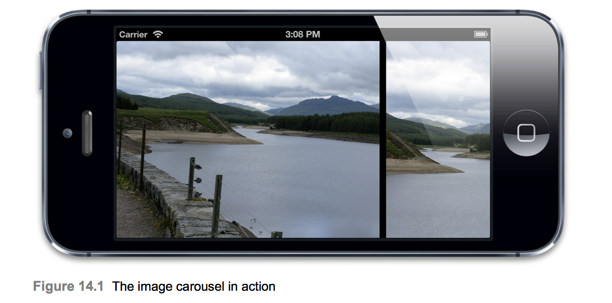

# Image IO
* `The idea of latency is worth thinking about. - Kevin Patterson`
* 13장 `Efficient Drawing`에서 Core Graphics 드로잉과 관련된 성능 문제와 이를 수정하는 방법을 살펴보았다. 드로잉 성능과 밀접하게 관련된 것은 이미지 성능이다. 이 장에서는 플래시 드라이브 또는 네트워크 연결을 통해 이미지로드 및 표시를 최적화하는 방법을 연구한다.

## Loading and latency
* 실제로 이미지를 그리는데 걸리는 시간은 일반적으로 성능에 있어 제한 요소가 아니다. 이미지는 많은 양의 메모리를 소비하므로 앱이 표시해야하는 모든 이미지를 메모리에 한번에 로드하는 것은 실용적이지 않을 수 있다. 즉, 앱이 실행되는 동안 주기적으로 이미지를 로드하거나 언로드 해야 한다.
* 이미지 파일을 로드할 수 있는 속도는 CPU뿐 만 아니라 IO(입력/출력) 대기 시간에 의해서도 제한된다. iOS 기기의 플래시 저장 용량은 기존 하드 디스크보다 빠르지만 RAM보다 약 200배 정도 느리므로 눈에 띄는 지연을 방지하기 위해 로드를 신중하게 관리해야 한다.
* 가능하면 응용 프로그램의 실행주기(예를들어 실행시 또는 화면 전환 사이)에서 눈에 띄지 않는 시간에 이미지를 로드해라. 버튼을 누르고 화면 상에 반응을 보는 것 사이의 maximum comfortable delay은 애니메이션 프레임 사이의 16ms보다 많은 약 200ms이다. 앱이 처음 시작될 때 이미지를 로드하는데 더 많은 시간을 할애할 수 있지만 20초 이내에 시작하지 않으면 iOS 워치 독 타이머가 앱을 종료한다.
* 경우에 따라 모든 것을 미리로드하는 것이 실용적이지는 않다. 잠재적으로 수천개의 이미지가 표함될 수 있는 이미지 캐러셀과 같은 것을 사용하지 말아라. 사용자는 속도 저하 없이 이미지를 빠르게 넘길 수 있지만 모든 이미지를 미리로드할 수는 없다. 너무 오래 걸리고 너무 많은 메모리를 소비한다.
* 이미지는 때로 원격 네트워크 연결에서 검색해야 할 수도 있다. 플래시 드라이브에서 로드하는 것보다 훨씬 많은 시간이 걸릴 수 있으며 연결문제(몇 초 동안 시도한 후)로 인해 완전히 실패할 수도 있다. 주 스레드에서 네트워크 로딩을 수행할 수 없으며 사용자는 정지된 화면에서 기다릴 것이다. 그러므로 백그라운드 스레드를 사용해야 한다.

### Threaded Loading
* 12장 `Tuning for Speed`의 연락처 목록 예제에서 이미지는 스크롤하면서 주 스레드에서 실시간으로 로드할 수 있을정도로 작았다. 그러나 큰 이미지의 경우 로드가 너무 오래 걸리고 스크롤이 더듬어 져 잘 작동하지 않는다. 스크롤링 애니메이션은 기본 실행 루프에서 업데이트되므로 렌더링 서버 프로세스에서 실행되는 CAAnimation보다 CPU관련 성능 문제에 더 취약하다.
* 아래 예제는 UICollectionView를 사용하여 구현된 기본 이미지 회전식 메뉴의 코드이다. 이미지로드는 `collectionView: cellForItem` 메소드의 주 스레드에서 동기적으로 수행된다.



```Swift
class CollectionViewCell_14_1: UICollectionViewCell {
    @IBOutlet weak var imageView: UIImageView!
}

class ViewController_14_1: UIViewController {
    @IBOutlet weak var collectionView: UICollectionView!
    
    var imagePaths: [String] = []
    
    override func viewDidLoad() {
        super.viewDidLoad()
        
        imagePaths = Bundle.main.paths(forResourcesOfType: "png", inDirectory: "VacationPhotos")
    }
}

extension ViewController_14_1: UICollectionViewDataSource {
    func collectionView(_ collectionView: UICollectionView, numberOfItemsInSection section: Int) -> Int {
        return imagePaths.count
    }
    
    func collectionView(_ collectionView: UICollectionView, cellForItemAt indexPath: IndexPath) -> UICollectionViewCell {
        guard let cell = collectionView.dequeueReusableCell(withReuseIdentifier: "CollectionViewCell_14_1", for: indexPath) as? CollectionViewCell_14_1 else {
            return UICollectionViewCell()
        }
        
        let imagePath = imagePaths[indexPath.row]
        cell.imageView.image = UIImage(contentsOfFile: imagePath)
        
        return cell
    }
}
```

* 회전식 컨베이어의 이미지는 약 700KB 크기의 800 × 600 픽셀 PNG로 아이폰 5가 1 초의 60 분의 1 이내에 로드 하기에는 너무 크다. 이러한 이미지는 carousel가 스크롤 될 때 즉시 로드되고, 예상대로 스크롤이 버벅인다. Time Profiler 도구 (그림 14.2 참조)는 UIImage + imageWithContentsOfFile : 메소드에서 많은 시간을 소비하고 있음을 보여줍니다. 분명 이미지로드가 병목 현상입니다.


* 여기서 성능을 향상시키는 유일한 방법은 이미지로드를 다른 스레드로 옮기는 것이다. 이것은 실제 로딩 시간을 줄이는 데는 도움이되지 않는다(시스템이 로드 된 이미지 데이터를 처리하는 데 CPU 시간을 더 줄이기 때문에 약간 더 나빠질 수도 있다).하지만 이는 메인 스레드가 계속 진행될 수 있음을 의미한다 사용자 입력에 응답하고 스크롤을 움직이는 것과 같은 다른 일을 한다.
백그라운드 스레드에서 이미지를로드하려면 CGD 또는 NSOperationQueue를 사용하여 자체 스레드 로딩 솔루션을 만들거나 CATiledLayer를 사용할 수 있다. 원격 네트워크에서 이미지를 로드하려면 비동기 NSURLConnection을 사용할 수 있지만 로컬 저장 파일에는 매우 효율적인 옵션이 아니다.